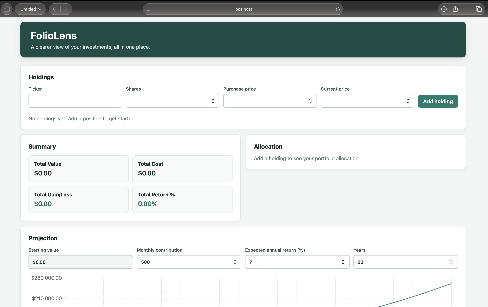
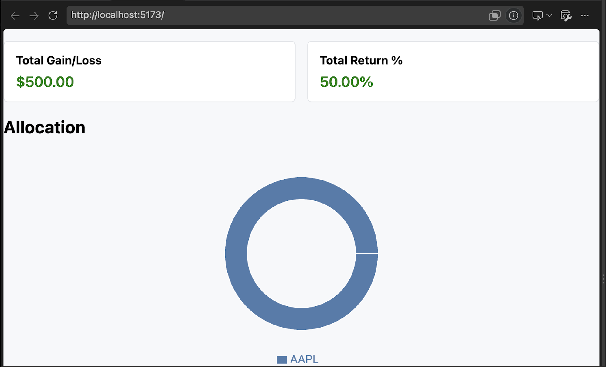
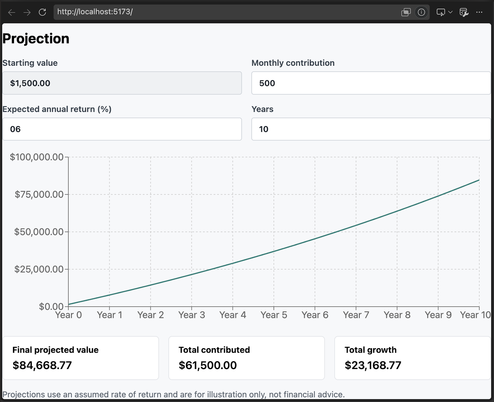
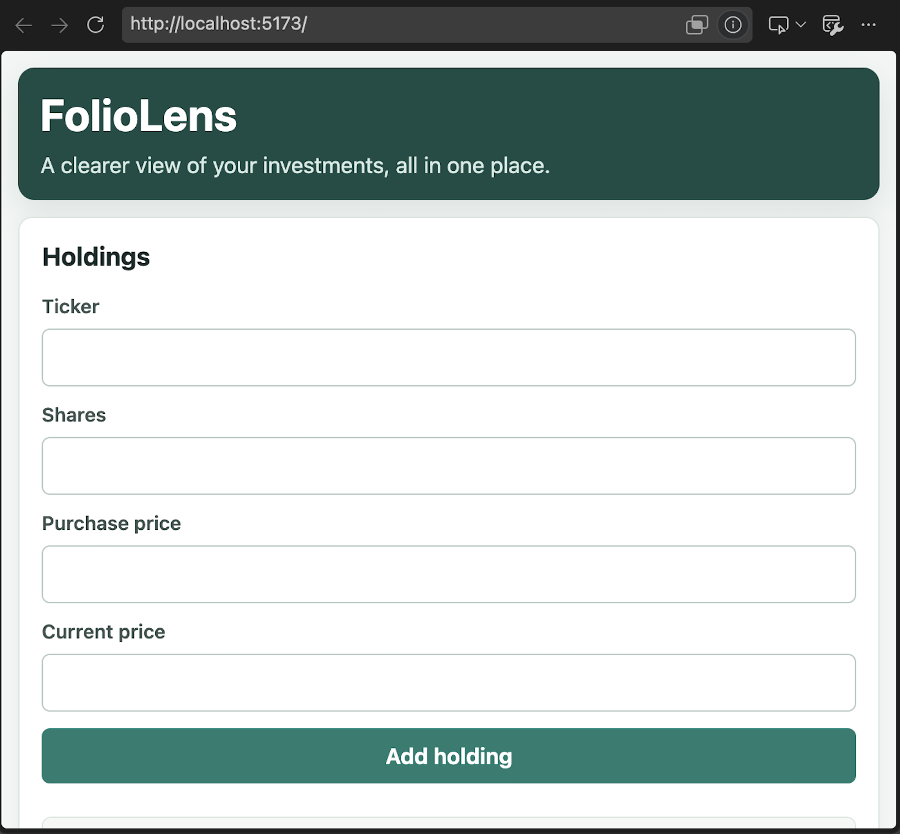

# FolioLens

FolioLens is a portfolio dashboard for tracking manually entered investment holdings and exploring illustrative growth projections.

Live demo: (https://appco-ten.vercel.app)

## Screenshots









## Features

- Add holdings with a ticker, share count, purchase price, and current price. Fractional shares are supported.
- Automatically combine entries with the same ticker, summing shares and calculating a weighted average purchase price.
- Remove holdings and retain portfolio data in the browser's local storage between visits.
- Review total portfolio value, cost basis, gain or loss, and return.
- View each ticker's portfolio allocation in a donut chart.
- See a concentration notice when a ticker exceeds 40% of the portfolio.
- Explore a growth projection with adjustable monthly contributions, annual return, and time horizon.
- View values formatted in U.S. dollars.

## Technologies Used

- React `^19.2.8` and React DOM `^19.2.8`
- Recharts `^3.10.1`
- Vite `^8.3.0`
- Vitest `^5.0.2`
- ESLint `^10.10.0`

## How to Run

### Prerequisites

- Node.js, using a version supported by Vite 8
- npm

### Setup and commands

```sh
git clone <repository-url>
cd <repository-directory>
npm install
npm run dev
```

Open the local URL printed by Vite to use the app. Run the test suite and create a production build with:

```sh
npm test
npm run build
```

## Usage Guide

1. In **Holdings**, enter a 1–5 letter ticker, number of shares, purchase price per share, and current price per share, then select **Add holding**. Prices and share counts are entered manually; FolioLens does not fetch live quotes.
2. Review the holdings table for each position's value, gain or loss, and return. If you add a ticker that is already listed, FolioLens combines the shares and recalculates the weighted average purchase price using the newly entered current price. Use **Delete** to remove a position.
3. Read the **Summary** metrics for the portfolio's total value, total cost, total gain or loss, and total return. The allocation chart shows how current value is distributed by ticker. The insight message flags any ticker whose allocation is greater than 40%.
4. In **Projection**, the starting value is the current total portfolio value. Adjust the monthly contribution, expected annual return, and number of years to see the projected year-end values, final projected value, total contributions, and projected growth.

Holdings are stored in the current browser's local storage. Clearing that browser data removes the saved portfolio.

## How the Projection Works

The projection uses monthly compounding. Let $V_m$ be the portfolio value at month $m$, $R$ the expected annual return percentage, and $C$ the monthly contribution. The monthly rate is $r = (R / 100) / 12$, and each month is calculated as:

$$V_{m+1} = V_m(1 + r) + C$$

The return is applied first, then the contribution is added at the end of the month. For a nonzero monthly rate, the equivalent value after $n$ months is:

$$V_n = V_0(1 + r)^n + C\frac{(1 + r)^n - 1}{r}$$

When the return is zero, the projection is $V_n = V_0 + nC$. The app reports a point for each year, using 12 monthly steps per year. It assumes a constant return and contribution, with no taxes, fees, inflation, or market volatility. It is an illustration, not a prediction of investment performance.

## Project Structure

```text
.
├── images/
├── public/
├── src/
│   ├── assets/
│   ├── components/
│   │   ├── AllocationChart.jsx
│   │   ├── HoldingForm.jsx
│   │   ├── HoldingsTable.jsx
│   │   ├── InsightsBanner.jsx
│   │   ├── ProjectionPanel.jsx
│   │   └── SummaryCards.jsx
│   ├── hooks/
│   │   └── useHoldings.js
│   ├── utils/
│   │   ├── calculations.js
│   │   ├── calculations.test.js
│   │   ├── constants.js
│   │   └── format.js
│   ├── App.jsx
│   ├── App.css
│   ├── index.css
│   └── main.jsx
├── eslint.config.js
├── index.html
├── package.json
└── vite.config.js
```

## Roadmap

- Live price data API
- CSV import and export
- Multi-currency support

## Disclaimer

FolioLens is an educational project and is not financial advice. Its projections are hypothetical and should not be used as a basis for investment decisions.